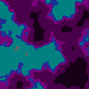

# PythonWorldGenerator
Generate realistic 2D world maps

## Method
the noise package is used to generate 2D perlin noise with certain parameters, this noise is then converted into an image where different "heights" or noise values are converted into specific colors representing types of terrain.  

## Sample Output

### Default Tiles:

### Custom Tiles:

