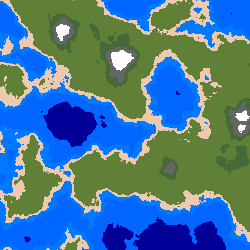

# PythonWorldGenerator
Generate realistic 2D world maps

## Method
the noise package is used to generate 2D perlin noise with certain parameters, this noise is then converted into an image where different "heights" or noise values are converted into specific colors representing types of terrain.  

## Custom Tiles
The color of every pixel is determined by the noise value at its X and Y values.  
To allow the user to change the apperance of the map, custom colors can be defined and applied through the UI.  
Just pick and RGB value, and a maximum height, and all future generated terrains will use the next highest height "Tile" for the color of each pixel.  
  
The Tiles do not need to be sorted, but it is reccomended that you go from lowest to highest while defining your own Tiles to make the process more straightforward. 

## Sample Output

### Default Tiles:

### Custom Tiles:

